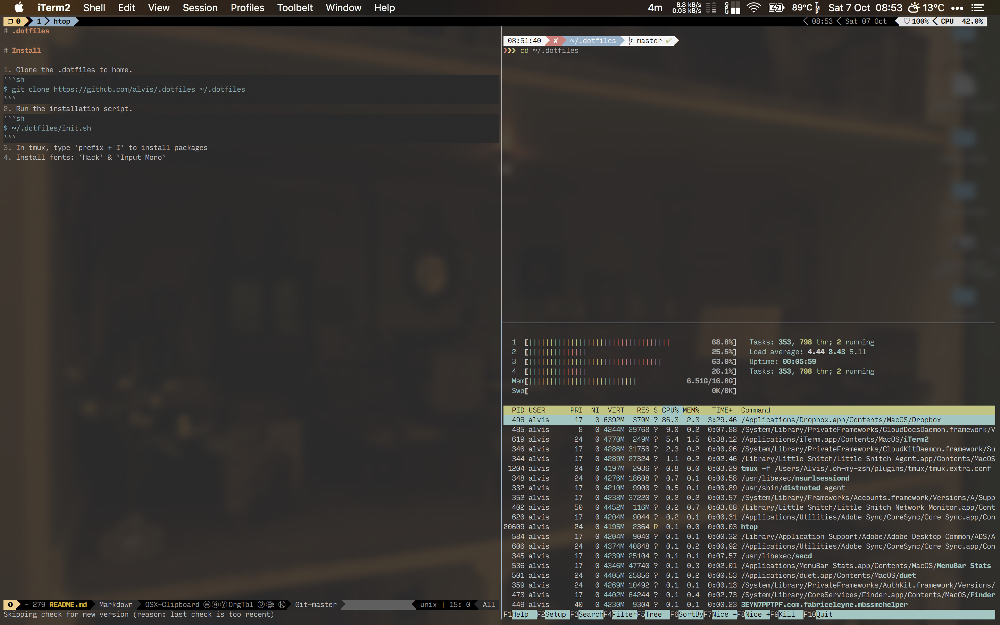

# .dotfiles



# Install

1. Clone the .dotfiles to home.
```sh
$ git clone https://github.com/alvis/.dotfiles ~/.dotfiles
```
2. Run the installation script.
```sh
$ ~/.dotfiles/init.sh
```
3. In tmux, type `prefix + I` to install packages
4. Install fonts: `Hack` & `Input Mono`
